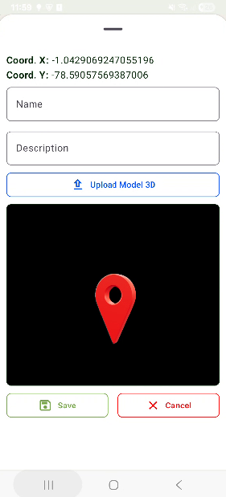

# 🌄 TurismoAR - Exploración Turística con Realidad Aumentada

**TurismoAR** es una aplicación móvil que fomenta el turismo local a través de experiencias inmersivas con **Realidad Aumentada (RA)**.  
Inicialmente enfocada en el cantón **Salcedo (Cotopaxi, Ecuador)**, pero adaptable a cualquier región mediante datos dinámicos.

---

## 🚀 Instalación

1. Descarga la última versión de la app desde la sección [releases](https://github.com/32TBAN/TurismoAR/releases)
2. Habilita la instalación desde fuentes desconocidas en tu dispositivo Android.
3. Instala el APK y abre la aplicación.
4. ¡Explora el mundo en RA! 📱✨

---

## 🎯 Objetivo del Proyecto

El propósito de **TurismoAR** es **conectar a turistas y locales con la historia, cultura y naturaleza** a través de experiencias interactivas.  
Queremos transformar una visita turística en algo educativo, atractivo y memorable, impulsando a la vez la economía local.

---

## 📱 Características principales

- 🗺️ Visualización de puntos turísticos sobre un mapa interactivo  
- 🧭 Modelos 3D geolocalizados mediante RA  
- 📂 Carga dinámica de datos desde archivos JSON  
- 🎨 Interfaz moderna con **Jetpack Compose**  
- 🧩 Modelos 3D creados en **Blender**  
- ⚡ Optimizada para Android con bajo consumo de batería  

---

## 🧑‍💻 Tecnologías utilizadas

| Tecnología            | Descripción |
|-----------------------|-------------|
| **Kotlin**            | Lenguaje principal de desarrollo |
| **Jetpack Compose**   | UI declarativa moderna en Android |
| **ARCore / Sceneform**| Motor de Realidad Aumentada |
| **Blender**           | Diseño y exportación de modelos 3D (`.glb`) |
| **GeoJSON-like data** | Sistema flexible para puntos turísticos |

---

## 🖼️ Capturas de Pantalla

---

## 📈 Roadmap

Lo que se viene próximamente:  

- [ ] 📱 **Soporte multiplataforma** (iOS con ARKit)  
- [ ] 🏆 **Compartir logros** con amigos o redes sociales  
- [ ] 👤 **Sistema de cuentas de usuario** (registro, login, personalización)  
- [ ] 🌐 **Conexión con APIs en vivo** para datos turísticos actualizados  
- [ ] 🎮 **Gamificación**: logros, recompensas y desafíos turísticos  

